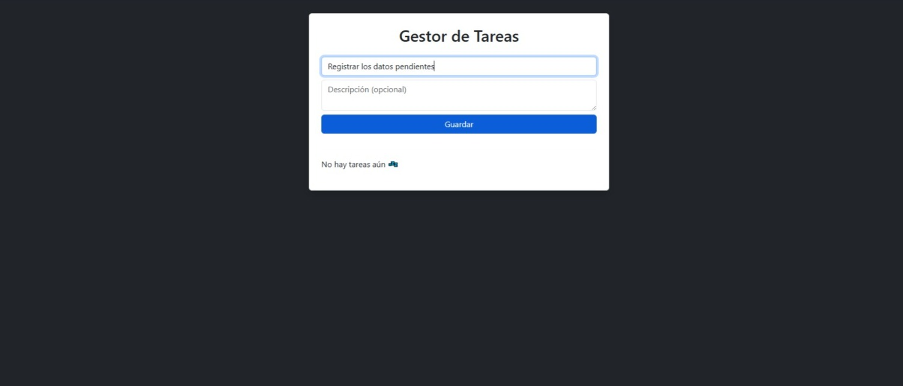
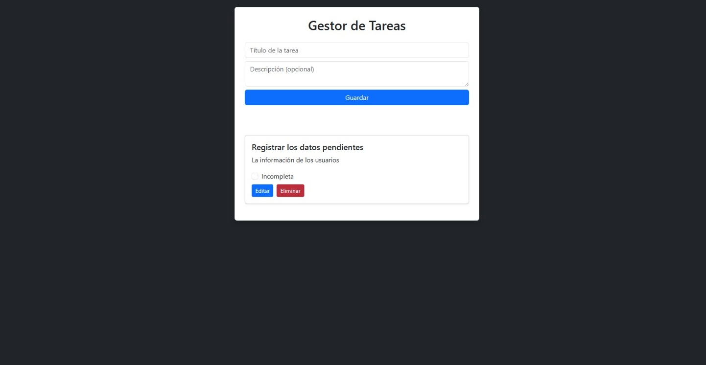

# 🚀 ForIT Todo App

Una aplicación de lista de tareas completa (Full-Stack) construida con **React** para el frontend, y un backend robusto con **Node.js** y **Express**. La aplicación utiliza **Vite** para un desarrollo frontend rápido y eficiente.

---

## Tabla de Contenidos

* [Acerca del Proyecto](#acerca-del-proyecto)
* [Características](#características)
* [Tecnologías Utilizadas](#tecnologías-utilizadas)
* [Instalación y Ejecución Local](#instalación-y-ejecución-local)
  * [Requisitos Previos](#requisitos-previos)
  * [Configuración del Backend](#configuración-del-backend)
  * [Configuración del Frontend](#configuración-del-frontend)
* [Screenshots](#screenshots)
* [Uso](#uso)
* [Contribuir](#contribuir)
* [Contacto](#contacto)

---

## Acerca del Proyecto

ForIT Todo App es una solución intuitiva para gestionar tus tareas diarias. Permite a los usuarios crear, leer, actualizar y eliminar tareas (CRUD), ofreciendo una experiencia fluida y reactiva gracias a React. **Actualmente, la aplicación no tiene una base de datos persistente conectada, lo que significa que las tareas se gestionan en memoria y se resetearán cada vez que el servidor de backend se reinicie.**

---

## Características

* **Creación de Tareas:** Agrega nuevas tareas con facilidad.
* **Visualización de Tareas:** Lista clara y organizada de todas tus tareas.
* **Edición de Tareas:** Modifica tareas existentes.
* **Eliminación de Tareas:** Elimina tareas completadas o no deseadas.

---

## Tecnologías Utilizadas

**Frontend:**
* **React:** Biblioteca de JavaScript para construir interfaces de usuario.
* **Vite:** Herramienta de construcción rápida para proyectos web modernos.
* **Bootstrap:** Framework de CSS para diseño responsivo y componentes de UI.

**Backend:**
* **Node.js:** Entorno de ejecución de JavaScript.
* **Express.js:** Framework de aplicaciones web para Node.js.
* **Sin Base de Datos Persistente:** Las tareas se almacenan en memoria (volátil). La idea es conectarlo a una base de datos con sqlite3.

---

## Instalación y Ejecución Local

Sigue estos pasos para levantar la aplicación en tu entorno local.

### Requisitos Previos

Asegúrate de tener instalado lo siguiente:

* **Node.js:** Versión 14 o superior. Puedes descargarlo desde [nodejs.org](https://nodejs.org/).
* **npm** (viene con Node.js) o **Yarn** (opcional).

### Configuración del Backend

1.  **Clonar el repositorio:**
    ```bash
    git clone https://github.com/MaxiScarpatti/forit-todo-app.git
    cd forit-todo-app
    ```

2.  **Acceder al directorio del backend:**
    ```bash
    cd backend # Asumiendo que tu backend está en la carpeta 'backend'
    ```

3.  **Instalar dependencias del backend:**
    ```bash
    npm install
    # o si usas yarn
    # yarn install
    ```

4.  **Configurar variables de entorno (opcional):**
    Si tu backend utiliza variables de entorno (por ejemplo, para el puerto), puedes crear un archivo `.env` en el directorio `server` y añadir:
    ```
    PORT=3000
    ```
    El servidor de backend usará por defecto el puerto 5000 si no se especifica.

5.  **Ejecutar el backend:**
    ```bash
    npm start
    # o si usas yarn
    # yarn start
    ```
    El servidor de backend debería estar funcionando en `http://localhost:5000`.

### Configuración del Frontend

1.  **Acceder al directorio del frontend:**
    Desde el directorio raíz de la aplicación, ve a la carpeta del frontend.
    ```bash
    cd frontend # Asumiendo que tu frontend está en la carpeta 'frontend'
    ```

2.  **Instalar dependencias del frontend:**
    ```bash
    npm install
    # o si usas yarn
    # yarn install
    ```

3.  **Configurar variables de entorno:**
    Crea un archivo `.env` en el directorio `client` y añade la URL de tu backend:
    ```
    VITE_API_URL=http://localhost:3000
    ```
    Asegúrate de que `VITE_API_URL` apunte a la dirección donde está corriendo tu backend.

4.  **Ejecutar el frontend:**
    ```bash
    npm run dev
    # o si usas yarn
    # yarn dev
    ```
    La aplicación de React debería abrirse en tu navegador, generalmente en `http://localhost:5173` (o un puerto similar, indicado por Vite).

---

## Screenshots

Aquí puedes ver la aplicación en funcionamiento:





---

## Uso

Una vez que la aplicación esté corriendo localmente:

1.  **Accede a la aplicación** en tu navegador (la URL será mostrada en tu terminal después de ejecutar `npm run dev` en el frontend).
2.  **Agrega nuevas tareas** usando el campo de entrada y el botón "Add Task".
3.  **Edita tareas** haciendo clic en el botón de edición (generalmente un icono de lápiz).
4.  **Elimina tareas** usando el botón de eliminar (generalmente un icono de papelera).

---

## Contribuir

¡Las contribuciones son bienvenidas! Si quieres mejorar este proyecto, por favor sigue estos pasos:

1.  Haz un "fork" del repositorio.
2.  Crea una nueva rama (`git checkout -b feature/AmazingFeature`).
3.  Realiza tus cambios y realiza "commit" (`git commit -m 'Add some AmazingFeature'`).
4.  Hacé "push" a la rama (`git push origin feature/AmazingFeature`).
5.  Abre un "Pull Request".

---

## Contacto

Maxi Scarpatti - [maxi.scarpatti@gmail.com]

Link del Proyecto: [https://github.com/MaxiScarpatti/forit-todo-app](https://github.com/MaxiScarpatti/forit-todo-app)
